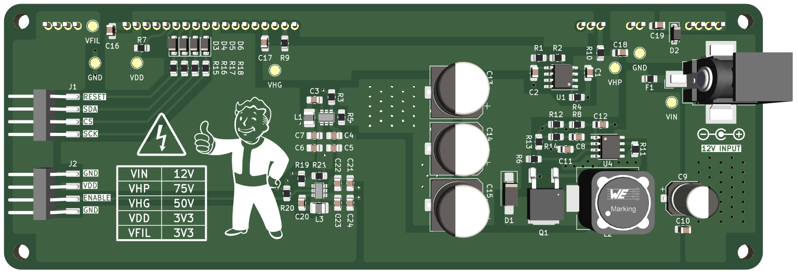

# VFD Power Supply

Power supply for the GP1294AI (also marketed as VFD25648) vacuum fluorescent display. The supply requires a 12V input source, and outputs the necessary voltages to drive the anodes and filaments of the display. 

> [!CAUTION]
> The power supply outputs **voltages up to 75V** DC which can be hazardous. Handle with care.

## Usage
The VFD Display can be soldered to the front of the PCB. All components of the power supply are surface-mount technology (SMT) and are placed on the backside of the PCB. Only connect the display to the PCB after verifying all voltages on the power supply using the provided measuring points. The display can be controlled using any microcontroller that uses 3V3 logic (ESP32, Raspberry Pi...) using the general purpose 2.54mm male headers on the board.

## Ordering PCB
The production files necessary for manufacturing are bundled in the compressed folder [export/manufacturing_files.zip](export/manufacturing_files.zip). The gerber files are generated according to the guidelines of fabrication house JLCPCB. It is recommended to order the PCB from JLCPCB by uploading the compressed folder to their website, but other manufacturers (PCBWay, Eurocircuits...) should work as well.

## Ordering Components
A bill of materials (BOM) is available for download. The BOM contains Digi-Key part numbers, and is formatted in a way that can be uploaded to the Digi-Key website for effortless ordering.
Alternatively, the URL below leads to a public product list on Digi-Key which can be used for ordering the parts. As of June 2024, the total component cost is ~€23.

> [!TIP]
> Order all necessary components by following [this link](https://www.digikey.be/nl/mylists/list/VK1I6PIG8G). 

## Assembly
For assembly, please make use of the provided [schematic](schematic.pdf), available in pdf format.
